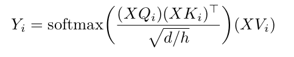
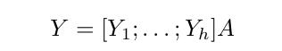
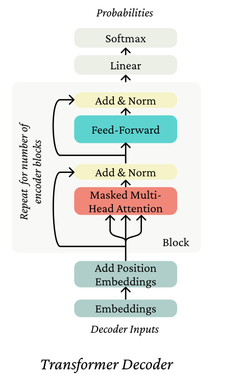
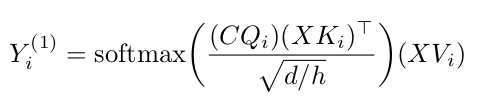
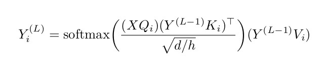

# Self-Attention, Transformers, and Pretraining

We’ll train a Transformer to perform a task (predicting the birth place of notable person) that involves accessing knowledge about the world — knowledge which isn’t provided via the task’s training data (at least if we want to generalize outside the training set). We’ll find that it more or less fails entirely at the task. We’ll then learn how to pretrain that Transformer on Wikipedia text that contains world knowledge, and find that finetuning that
Transformer on the same knowledge-intensive task enables the model to access some of the knowledge learned at pretraining time. We’ll find that this enables models to perform considerably above chance on a held out development set.

We will use two architectures of the Transformer decoder in ths. The first one is the vanilla transfomer decoder while the second one is **Perceiver AR**. 

**1. Vanilla Transformer Decoder**

The provided CausalSelfAttention layer implements the following attention for each head of the multi-headed attention: Let X ∈ R<sup>ℓ×d</sup> (where ℓ is the block size and d is the total dimensionality, d/h is the dimensionality per head.).
Let Q<sub>i</sub>, K<sub>i</sub>, V<sub>i</sub> ∈ R<sup>d×d/h</sup> . Then the output of the self-attention head is


    
where Y<sub>i</sub> ∈ R<sup>ℓ×d/h</sup>. Then the output of the self-attention is a linear transformation of the concatenation of the heads:



where A ∈ R<sup>d×d</sup> and Y ∈ R<sup>ℓ×d</sup>.

The model uses this self-attention layer in the transformer block as shown in the figure below.



**2. Perveiver AR**

In the Perceiver model architecture, we replace the first transformer Block in the model with the *DownProjectBlock*. This block reduces the length of the sequence from ℓ to m. This is followed by a series of regular transformer blocks, which would now perform self-attention on the reduced sequence length of m. We replace the last block of the model with the *UpProjectBlock*, which takes in the m length output of the previous block, and projects it back to the original sequence length of ℓ.

*DownProjectBlock* - To do this, we perform cross-attention o do this, perform cross-attention on the input sequence with a learnable basis C ∈ R<sup>m×d</sup> as the query, where m < ℓ.



resulting in Y<sub>i</sub> ∈ R<sup>m×d</sup> , with <sup>(1)</sup> denoting that the output corresponds to the first layer. With this dimensionality reduction, the subsequent CausalSelfAttention layers operate on inputs ∈ R<sup>m×d</sup> instead of R<sup>l×d</sup>.
    
*DownProjectBlock* - To get back to the original dimensions, the last block in the model is replaced with the UpProjectBlock. This block will bring back the output sequence length to be the same as input sequence length by performing cross-attention on the previous layer’s output Y<sup>L−1</sup> with the original input vector X as the query:



where L is the total number of layers. This results in the final output vector having the same di-mension as expected in the original *CausalSelfAttention* mechanism.

More information on Perceiver AR can be found [here](https://arxiv.org/pdf/2202.07765)

## Setup

The Code is written in Python 3.12.2 . If you don't have Python installed you can find it [here](https://www.python.org/downloads/). If you are using a lower version of Python you can upgrade using the pip package, ensuring you have the latest version of pip

```
conda env create -f local_env.yml
conda activate transformer
```

## Dataset

For this experiment, we used two datasets.

1. `birth_places_train.tsv` - TSV (tab-separated values) file of name/place pairs. We used this dataset to fine-tune our model

2. `Wiki.txt` - It contains a few lines from Wikipedia where each line corresponds to some information (including birth place info) of some famous personalities. We used this dataset to pre-train the model

Both `.txt` files are attached to this repository

## Usage

1. Clone the repository

    `git clone https://github.com/shasha3493/Self-Attention-Transformers-and-Pretraining.git`
  
2. Change to the working directory

    `cd Self-Attention-Transformers-and-Pretraining`
    
3. To train the model 
    
    **a. Without Pretrainig**
    
        - Train the model directly on birth_places_train.tsv
            
            python src/run.py finetune vanilla wiki.txt \
                    --writing_params_path vanilla.model.params \
                    --finetune_corpus_path birth_places_train.tsv
                    
        - Evaluate on the dev set, writing out predictions
            
            python src/run.py evaluate vanilla wiki.txt \
                    --reading_params_path vanilla.model.params \
                    --eval_corpus_path birth_dev.tsv \
                    --outputs_path vanilla.nopretrain.dev.predictions
                    
        - Evaluate on the test set, writing out predictions
        
            python src/run.py evaluate vanilla wiki.txt \
                    --reading_params_path vanilla.model.params \
                    --eval_corpus_path birth_test_inputs.tsv \
                    --outputs_path vanilla.nopretrain.test.predictions
                    
    **b. Pretrain vanilla architecture and fine tune**
        
        - Pretrain the model on wiki.txt
        
            python src/run.py pretrain vanilla wiki.txt \
                    --writing_params_path vanilla.pretrain.params
        
        - Finetune the model on birth_places_train
        
            python src/run.py finetune vanilla wiki.txt \
                    --reading_params_path vanilla.pretrain.params \
                    --writing_params_path vanilla.finetune.params \
                    --finetune_corpus_path birth_places_train.tsv
        
        - Evaluate on the dev set; write to disk
            
            python src/run.py evaluate vanilla wiki.txt \
                    --reading_params_path vanilla.finetune.params \
                    --eval_corpus_path birth_dev.tsv \
                    --outputs_path vanilla.pretrain.dev.predictions
        
        
        - Evaluate on the test set; write to disk
        
            python src/run.py evaluate vanilla wiki.txt \
                    --reading_params_path vanilla.finetune.params \
                    --eval_corpus_path birth_test_inputs.tsv \
                    --outputs_path vanilla.pretrain.test.predictions
                    
    **c. Pretrain Perceiver AR and fine tune**
        
        - Pretrain the model on wiki.txt
        
            python src/run.py pretrain perceiver wiki.txt --bottleneck_dim 64 \
                    --pretrain_lr 6e-3 --writing_params_path perceiver.pretrain.params
        
        - Finetune the model on birth_places_train
        
            python src/run.py finetune perceiver wiki.txt --bottleneck_dim 64 \
                    --reading_params_path perceiver.pretrain.params \
                    --writing_params_path perceiver.finetune.params \
                    --finetune_corpus_path birth_places_train.tsv
        
        - Evaluate on the dev set; write to disk
            
            python src/run.py evaluate perceiver wiki.txt --bottleneck_dim 64 \
                    --reading_params_path perceiver.finetune.params \
                    --eval_corpus_path birth_dev.tsv \
                    --outputs_path perceiver.pretrain.dev.predictions
        
        
        - Evaluate on the test set; write to disk
        
            python src/run.py evaluate perceiver wiki.txt --bottleneck_dim 64 \
                    --reading_params_path perceiver.finetune.params \
                    --eval_corpus_path birth_test_inputs.tsv \
                    --outputs_path perceiver.pretrain.test.predictions

## Results

## Accuracy

Note: As s reference point, the accuracy the model if it just predicts “London” as the birth place for everyone in the dev set = 5%. We will use this reference point to compare our models

### 1. Vanilla Transformer Decoder

- Accuracy when training the model directly on `birth_places_train.csv` : 2%

- Accuracy when pre-training and them finetuning: 22.4% 
    

### 2. Perceiver AR model:
    
- Accuracy when pre-training and them finetuning: 16.67.4% 

**The pretrained model achieved higher accuracy (more than benchmark) because it had prior knowledge from being trained on a large dataset. It learned patterns and features during pretraining, enabling it to generalize better on new examples. In contrast, the non-pretrained model started from scratch, lacking the initial knowledge and taking longer to learn meaningful representations, resulting in
lower accuracy.**

## Training Speed up

1. The vanilla tranformer decoder, on an average, takes about 4.8s while Perceiver AR takes about 2.42s which is around 50% speed up. This is mainly due to reducing the context length and thereby reducing the number of attention operations. 
